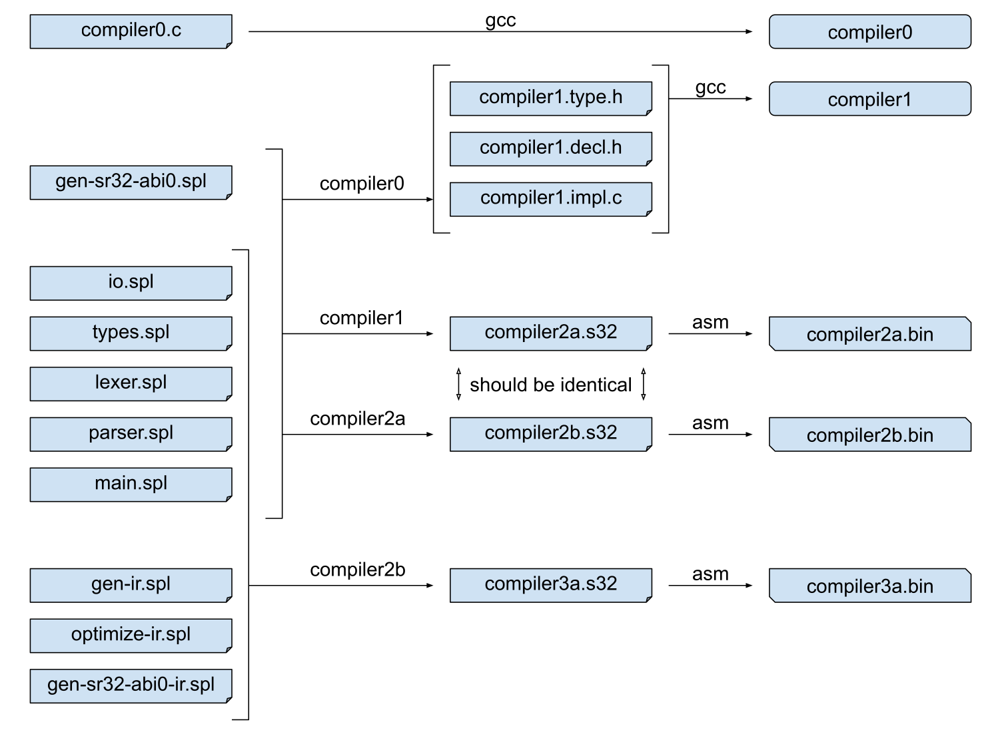

# Systems Programming Language

A small compiled language borrowing ideas from C, Go, Rust, Zig.

Very much a work in progress.

The next phase of https://github.com/swetland/compiler/

## Organization

- [bootstrap/...](bootstrap/) - an SPL to C transpiler, written in C (compiler0)
- [compiler/...](compiler/) - an SPL compiler, written in SPL (compiler1)
- [build/...](build/) - build scripts
- [test/...](test/) - automated tests (SPL source and "golden" output)
- [demo/...](demo/) - programs to exercise the compiler
- [vim/...](vim/) - SPL syntax highlighting (install in `~/.vim/pack/plugins/start/spl`)

## Build Process

A very simple to-C transpiler (stage 0), which supports just a minimum language
feature set, is used to build an initial version of the compiler (stage 1) from
a subset of the compiler source code.  This stage 1 compiler is used to build
itself from source, resulting in a stage 2a compiler that is capable of building
itself (stage 2b) and is featureful enough to build the stage 3 compiler.  The
stage 3 compiler shares the front-end source code, but has a more complete backend,
optimizer, etc.

